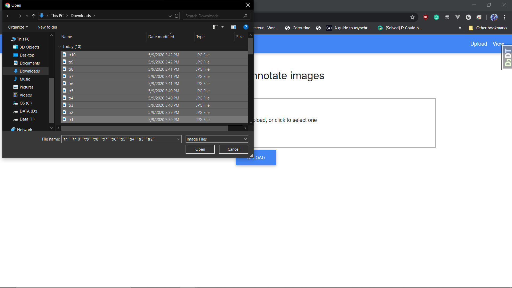
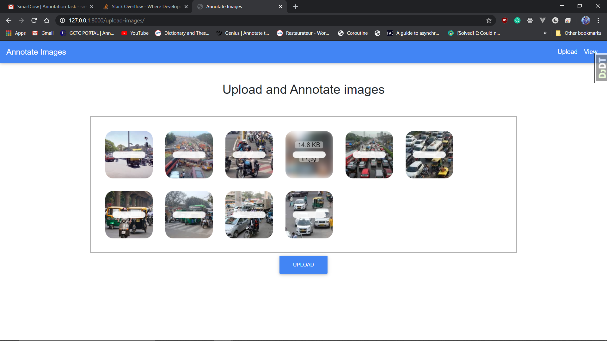
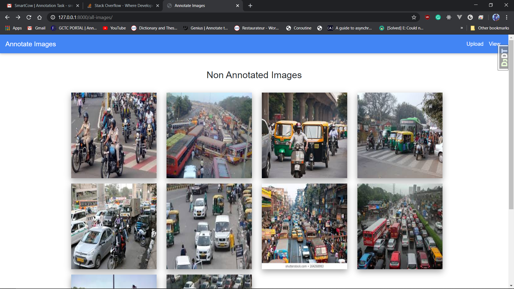
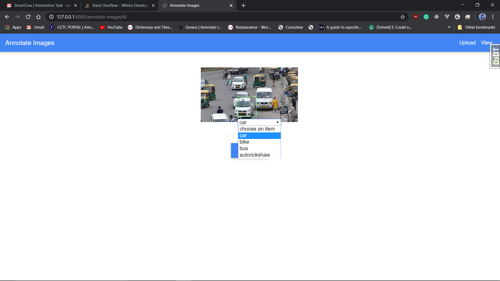

# Image Annotator

### Tech Stack

- Django
- sqlite3 for dev DB
- html + css (md bootstrap) + jquery/js

### Run the code by the following commands

```python
    python manage.py migrate
    python manage.py runserver
```

### Go to http://127.0.0.1:8000/ or http://localhost:8000/

### Usage

- Go to http://127.0.0.1:8000/upload-images/ to upload images

- Drag and drop or upload multiple images and hit submit

  

  

- Go to http://127.0.0.1:8000/all-images/ to view uploaded images

- click on the image you want to annotate

  

- It will go to a new page, where you can annotate the image

  

- Annotate the image and hit submit to save the image to DB, it will save the data to DB and redirect to the previous page, where you can view the annotated images below

  

- click on the annotate image to view the annotations and download the **.csv file**

  

- click the download button to download the csv file

  
